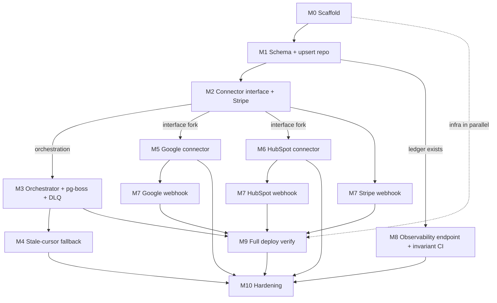

# EXECUTION.md — Parallelization & External Dependencies

> Companion to [`PLAN.md`](./PLAN.md). The plan has **14 numbered sections**, but only **§12 is the
> buildable roadmap** — it contains **11 milestones (M0–M10)**. Sections 1–11 and 13–14 are reference
> material (architecture, schema, strategy, testing, setup, assumptions), not work items.
> Parallelization below applies to the **11 milestones**.

---

## Part 1 — Milestone Dependencies & Parallel Grouping

### Dependency graph

### The critical path (cannot be parallelized)

**M0 → M1 → M2** is strictly sequential. Everything hinges on two artifacts: the **upsert repository**
(M1) and the **connector interface** (early M2). Until the interface exists, no connector work can
fork off. Treat this as the single-owner spine of the project.

### Parallel waves

| Wave | Milestones (run together) | Depends on | Why they group |
|---|---|---|---|
| **1 – Foundation** | **M0** + (infra prep pulled from M9: Render account, GitHub repo, CD skeleton) | — | Scaffold and infra are independent; a second person can stand up Render/CI while M0 is coded. |
| **2 – Core spine** | **M1 → M2** *(sequential)* | M0 | Defines the data layer + connector contract. The fork point is the moment the `SourceConnector` interface lands. |
| **3 – Parallel tracks** | **Track A:** M3 → M4 · **Track B:** M5 ∥ M6 · **Track C:** M8 | M2 (interface), M1 (ledger) | Connectors are independent modules implementing one contract; orchestration and observability touch different files. |
| **4 – Integration** | **M7** (split per source) + **M9** full deploy verify | M3, M5, M6 | Webhooks attach to their connector; full deploy needs webhooks + scheduler live. |
| **5 – Hardening** | **M10** | everything | Stretch; load test + windowed backfill. |

### Highest-value parallelism

- **M5 (Google) ∥ M6 (HubSpot)** — fully independent connectors; the biggest win with two developers.
- **Track A (M3→M4) ∥ Track B (connectors)** — orchestration logic vs. connector modules don't collide.
- **M8 (observability) ∥ connectors** — once the ledger table exists, the `/admin/metrics` endpoint and
  reconciliation-invariant CI test can be built alongside everything.
- **M7 split per source** — fold each source's webhook into its connector track (Stripe webhook with M2,
  Google with M5, HubSpot with M6) rather than treating M7 as one late milestone.

### Recommended adjustments to enable the parallelism

1. **Create `sync_run`, `webhook_events`, and `quarantine` tables in M1** (alongside `records`), not in
   M7/M8. M2's own DoD already assumes the `sync_run` ledger exists ("ledger written; reconciliation
   invariant holds"), so this just makes the dependency explicit and unblocks the parallel tracks.
2. **Stand up the Render service + Postgres + auto-deploy during Wave 1**, so you deploy continuously
   from M0 rather than integrating deploy as a big-bang at M9.

> **Solo developer:** the waves still tell you what to batch into a single PR/context, and that
> M5/M6/M8 are safe to interleave without merge conflicts.

---

## Part 2 — External Setup Requirements

None of these are code — they're accounts, credentials, and tooling to provision externally.
Organized by category, with the milestone that first needs each.

### ☁️ Cloud infrastructure / hosting
| Item | Needed for | Notes |
|---|---|---|
| **Render account** | M9 (create in Wave 1) | Free tier. Connect to GitHub for auto-deploy. |
| **Render Web Service** | M9 | Single NestJS process. |
| **Render PostgreSQL (managed, free)** | M9 | ⚠️ Free instance deleted ~30 days after creation. |

### 🗄️ Databases
| Item | Needed for | Notes |
|---|---|---|
| **Local PostgreSQL 16 (Docker Compose)** | M0/M1 | Primary local dev DB. |
| **pg-boss** | M3 | No separate service — uses the *same* Postgres (own schema). |

### 🔌 Third-party data-source accounts & APIs
| Item | Needed for | Notes / lead time |
|---|---|---|
| **Stripe account + Test mode** | M2 | Instant. `sk_test_…` secret key. |
| **HubSpot free Developer account + test account** | M6 | Quick signup. |
| **HubSpot Private App** (read token) | M6 | Scopes e.g. `crm.objects.contacts.read`. |
| **HubSpot Developer/Public App** + webhook subscriptions | M7 | ⚠️ Private apps **cannot** do webhooks — separate app required; more setup friction. |
| **Google Cloud project + Calendar API enabled** | M5 | |
| **Google OAuth consent screen (Testing)** + OAuth 2.0 Client | M5 | Add yourself as a test user. |
| **Google test calendar + sample events** | M5 | Seed via UI or `events.insert`. |
| **Google domain verification** (for `events.watch` push) | M7 (optional/stretch) | ⚠️ Highest lead time — can take a day. Polling-first means this is deferrable. |

### 🔐 Authentication / secrets
| Item | Needed for | Notes |
|---|---|---|
| **Stripe webhook signing secret** (`whsec_…`) | M7 | From Stripe CLI (`stripe listen`) or dashboard. |
| **Google OAuth client id/secret + refresh token** | M5 | ⚠️ Mint the refresh token via OAuth Playground or a one-time consent script — easy to forget, blocks M5. |
| **HubSpot webhook signing secret** | M7 | From the public app. |
| **Admin/internal auth token** | M8 | Protects `/admin/metrics` and `/internal/sync`. You generate this. |
| **`.env` (local) + Render env vars (prod)** | M0+ | `.env.example` enumerates every key. |

### 🛠️ Developer tools / CLIs
| Item | Needed for | Notes |
|---|---|---|
| **Node.js 20 LTS + npm** | M0 | |
| **Docker + Docker Compose** | M0 | Local Postgres. |
| **Git + GitHub repository** | M0 (CI), M9 (CD) | |
| **Stripe CLI** | M2/M7 | Webhook forwarding + `stripe trigger` test events. |
| **ngrok** (or use the Render URL) | M7 | Tunnel webhooks to localhost. |
| **Google Cloud Console / OAuth Playground access** | M5 | To configure OAuth + mint the refresh token. |

### 🔄 CI / CD
| Item | Needed for | Notes |
|---|---|---|
| **GitHub Actions** (lint + test) | M0 | testcontainers needs Docker-in-CI. |
| **Render ↔ GitHub auto-deploy** | M9 | Stand up in Wave 1, deploy continuously. |

### 📊 Monitoring / observability
| Item | Needed for | Notes |
|---|---|---|
| **No external service required** | — | Deliberate: the DB-backed `sync_run` ledger + Render logs are the source of truth on free tier. Optional `prom-client` `/metrics` (no account). |

### 💳 Payment gateway
- **Stripe test mode only** (above). No live keys, no real charges — `stripe trigger` simulates events.

---

### ✅ Minimum to start coding today (M0)
Only four things gate the first line of code: **Node 20**, **Docker**, **Git/GitHub**, and (recommended)
a **Render account**. Everything else maps to M2+.

### ⏱️ Provision early despite not being needed until later
Because of setup friction/lead time, kick these off in Wave 1 even though they're consumed later:
**Google OAuth refresh token** (M5), **HubSpot public app for webhooks** (M7), and **Google domain
verification** if you want push notifications (M7).
