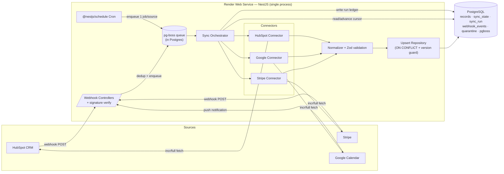

# PLAN.md — Multi-Source Data Sync Pipeline

## 1. Context

We are building a **production-grade data sync pipeline** from scratch. It ingests records
from three heterogeneous SaaS sources — **HubSpot (CRM)**, **Stripe (payments)**, and
**Google Calendar (events)** — and lands them in **one normalized schema** in PostgreSQL.

The pipeline must be correct under real-world failure modes: duplicate webhooks, stale/expired
incremental cursors, out-of-order updates, a source being down, and a source returning garbage.
None of these may produce duplicate rows, lost data, or a wedged run.

**Hard requirements (acceptance criteria):**

1. **Normalization** — all three sources map into one unified schema.
2. **Incremental + full fetch** — incremental by default; full fetch available.
3. **Stale-cursor fallback** — a rejected/expired cursor auto-falls back to a full backfill.
4. **Idempotent writes** — replays and re-runs never create duplicate rows.
5. **Fault isolation** — one source failing must not stop the other two.

**Deployment constraint (drives architecture):** Render **free tier** — no always-on background
workers, no free cron, free web services spin down after ~15 min idle (cold start on next
request), and the free Redis/Key-Value tier has eviction + no persistence (unsafe as a queue).
**Consequence:** a single NestJS web service does everything, the job queue lives in **Postgres**
(no Redis), and scheduling is **in-process** (with a documented self-healing strategy for missed
ticks).

---

## 2. Architecture Overview

Two ingestion paths feed the same normalization + upsert core:

- **Scheduled (polling) path** — an in-process cron enqueues one isolated job per source; each
  job runs the connector's incremental (or full) fetch.
- **Webhook path** — provider POSTs land on signature-verified controllers, are deduped against a
  webhook ledger, then enqueue a targeted fetch/normalize job for the affected record(s).



**Data flow (one source, one run):**
`trigger → orchestrator reads sync_state → connector.fetchIncremental(cursor) [or fetchFull on stale] → per-record normalize+validate → upsert (idempotent) → checkpoint cursor → write sync_run ledger`.

---

## 3. Technology Stack Decisions

Each decision states **what**, **why**, and the **main rejected alternative**.

| Concern | Decision | Why | Rejected alternative |
|---|---|---|---|
| Language | **TypeScript (Node 20 LTS)** | First-class official SDKs for all 3 sources; one language for webhook + worker; strong types make the normalization boundary safe. | Python — excellent ETL ecosystem, but no benefit here and a second language to operate. |
| Framework | **NestJS 11** | DI maps 1:1 to the connector pattern (each source = a module implementing one interface); built-in `@nestjs/schedule`, guards for webhook signature verification, interceptors for logging/metrics, typed config. | Bare Express/Fastify — more boilerplate, no DI/module structure. Temporal/Airflow — overkill and not free-tier friendly on Render. |
| Database | **PostgreSQL 16** | Native atomic upserts (`INSERT … ON CONFLICT DO UPDATE`), a `WHERE` clause on the conflict update for out-of-order guards, `JSONB` for raw payloads + unmapped fields, partial/expression indexes for dedup. Free on Render. **Doubles as the job queue (pg-boss), so no Redis is needed.** | MySQL — weaker JSON, less expressive upsert, no first-class free tier on Render. MongoDB — weaker fit for a strict normalized relational schema and still needs a separate queue. |
| ORM / migrations | **Drizzle ORM** | `.onConflictDoUpdate({ target, set, where })` compiles to native Postgres `ON CONFLICT` — exactly the atomic, version-guarded upsert we need. SQL-first, type-safe, lightweight, simple migrations. | **Prisma** — ergonomic, but `prisma.x.upsert()` is a non-atomic SELECT-then-write that can race under concurrent webhook+poll; would force raw SQL for the core write anyway. TypeORM — heavier; Drizzle's explicit conflict API is cleaner here. |
| Queue / broker | **pg-boss (Postgres-backed)** | Durable jobs, retries with exponential backoff, delayed/scheduled jobs, dead-letter retention — all in the DB we already run. Runs in-process, fitting the single-service free-tier topology. | BullMQ/Redis — needs Redis (not durable/free on Render). SQS — AWS, not on Render. |
| Scheduler | **`@nestjs/schedule` (`@Cron`) in-process** | Zero extra infra; lives in the web service. Missed ticks while the service sleeps **self-heal**: cursor-based incremental means the next run fetches everything changed since the last committed cursor — delayed, never lost. | External cron pinger / Render Cron Job — more reliable freshness but adds a moving part / cost. Documented as the upgrade path (§14). |
| Validation | **Zod** | Parses raw payloads into typed records at the normalization boundary; a parse failure routes the record to quarantine instead of crashing the batch. | `class-validator` — fine, but Zod's `safeParse` + inferred types fit the per-record quarantine flow better. |
| Source SDKs | `@hubspot/api-client`, `stripe`, `googleapis` | Official, maintained, handle auth + pagination + signature verification helpers. | Hand-rolled `fetch` clients — reinvents pagination, retries, and webhook verification. |
| Logging | **pino** (`nestjs-pino`) | Structured JSON logs with `run_id`/`source` correlation; cheap; readable in Render logs. | Winston — heavier, less performant. |
| Resilience libs | **p-retry** + **bottleneck** (per-source rate limiter) | Backoff with jitter; per-source concurrency/rate caps so one source's 429s can't starve others. | Custom retry loops — error-prone. |
| Deployment | **Render: 1 Web Service (NestJS) + 1 Render PostgreSQL (free)** | Matches the constraint; single artifact; migrations run on deploy; HTTPS endpoint for webhooks. | Multi-service (web + worker + Redis) — not free; not needed once the queue is in Postgres. |

---

## 4. Unified Schema Design

The three sources describe **different domains** (people, payments, calendar events), so the
"single normalized schema" is one **`records`** table (the unified envelope + idempotency
machinery) with a **`canonical_type`** discriminator, a curated set of common columns, and
`JSONB` for the long tail. This satisfies "one normalized schema" while preserving full fidelity.

### 4.1 Tables

**`records`** — the canonical store (one row per source object):

| Column | Type | Notes |
|---|---|---|
| `id` | `uuid` PK | Surrogate key (internal FKs/joins). |
| `source` | `enum(hubspot,stripe,google_calendar)` | Part of natural key. |
| `source_object_type` | `text` | e.g. `contact`, `customer`, `charge`, `event`. Part of natural key. |
| `source_id` | `text` | Source's native id. Part of natural key. |
| `canonical_type` | `enum(party,transaction,event)` | What this row *is* after normalization. |
| `external_created_at` | `timestamptz` | Source creation time. |
| `external_updated_at` | `timestamptz` | **Drives out-of-order resolution.** |
| `title` / `name` / `email` | `text` | Common identity/label fields (nullable per type). |
| `amount` / `currency` / `status` | `numeric` / `text` / `text` | Transaction fields (nullable per type). |
| `start_at` / `end_at` | `timestamptz` | Event fields (nullable per type). |
| `description` / `url` | `text` | Common descriptive fields. |
| `attributes` | `jsonb` | Normalized but type-specific fields that don't fit common columns. |
| `raw` | `jsonb` | Untouched source payload (audit/replay; handles "doesn't map cleanly"). |
| `content_hash` | `text` | Hash of normalized content → change detection / no-op dedup. |
| `deleted_at` | `timestamptz` null | Soft delete (source archive/cancel/refund). |
| `first_seen_at` / `last_synced_at` | `timestamptz` | Provenance. |

- **Natural key (unique):** `UNIQUE (source, source_object_type, source_id)` → the upsert target.
- **Indexes:** the unique key; `(canonical_type)`; `(external_updated_at)`; GIN on `attributes` if queried.

**Supporting tables:** `sync_state` (cursors §7), `sync_run` (ledger §9), `webhook_events`
(dedup ledger §6), `quarantine` (bad payloads §8). pg-boss owns its own `pgboss` schema.

> **Unmapped / non-mapping fields:** anything without a canonical column goes into `attributes`
> (normalized, queryable) or `raw` (verbatim, for audit/replay). No source field is ever dropped.

### 4.2 Field-Mapping Table

| Canonical field | HubSpot (contact) | Stripe (customer / charge) | Google Calendar (event) |
|---|---|---|---|
| `source_id` | `id` | `id` | `id` |
| `canonical_type` | `party` | `party` (customer) / `transaction` (charge) | `event` |
| `email` | `properties.email` | `email` (customer) | → `attributes.attendees[]` / `organizer.email` |
| `name` | `properties.firstname` + `lastname` | `name` (customer) | — |
| `title` | — | `description` (charge) | `summary` |
| `amount` | — | `amount / 100` (charge) | — |
| `currency` | — | `currency` | — |
| `status` | `properties.lifecyclestage` | `status` (charge) | `status` (confirmed/cancelled) |
| `start_at` / `end_at` | — | — | `start.dateTime`/`date`, `end.dateTime`/`date` |
| `description` | — | `description` | `description` |
| `url` | — | `receipt_url` | `htmlLink` |
| `external_created_at` | `properties.createdate` | `created` | `created` |
| `external_updated_at` | `properties.hs_lastmodifieddate` | event `created` ts | `updated` |
| `deleted_at` | `archived == true` | `refunded` / `customer.deleted` | `status == cancelled` |
| `attributes` (JSONB) | phone, company, custom props | payment_method, customer ref, metadata | location, attendees[], recurrence, hangoutLink |
| `raw` (JSONB) | full object | full object | full object |

---

## 5. Per-Source Connector Design

### 5.1 The Connector Contract

Every source implements one interface; the orchestrator is source-agnostic.

```ts
interface SourceConnector<TRaw = unknown> {
  readonly source: SourceName;

  // Incremental: stream batches of changes since the stored cursor.
  // Each batch carries a checkpoint cursor so progress survives a crash.
  fetchIncremental(cursor: Cursor | null): AsyncIterable<RawBatch<TRaw>>;

  // Full backfill: stream everything (paginated). The final batch yields a
  // fresh cursor that can seed incremental going forward.
  fetchFull(): AsyncIterable<RawBatch<TRaw>>;

  // Pure: raw -> 0..n canonical records. Validates via Zod; throws -> quarantine.
  normalize(raw: TRaw): NormalizedRecord[];

  // Verify signature + parse a webhook into targets to fetch (or inline records).
  parseWebhook(req: WebhookRequest): WebhookEvent[];

  // Is this error a stale/expired cursor that should trigger a full backfill?
  isStaleCursorError(err: unknown): boolean;
}

type RawBatch<T> = { records: T[]; checkpoint: Cursor | null };
```

The orchestrator owns the control flow (read cursor → incremental → catch stale → full →
normalize → upsert → checkpoint → ledger), so connectors only encode source-specific mechanics.

### 5.2 Source Notes

**HubSpot (CRM)**
- **Auth:** Private App access token (Bearer) for reads. *Webhooks require a public/developer
  app* with subscriptions — a private app cannot subscribe. (Assumption noted in §14.)
- **Incremental:** CRM Search API — `POST /crm/v3/objects/{type}/search` filtered on
  `hs_lastmodifieddate > cursor`, sorted ascending, paged via `after`. Cursor = last
  `hs_lastmodifieddate` seen.
- **Full:** paginate `GET /crm/v3/objects/{type}` (or search with no time filter), ordered by
  last-modified, capturing the latest timestamp as the resume cursor.
- **"Stale" failure:** timestamps don't expire, but the search `after` paging token is short-lived
  and the search window caps at 10k results. Failure mode = rejected paging token / over-window →
  restart the search from the stored timestamp (windowed). Lost/corrupt cursor → full backfill.

**Stripe (payments)**
- **Auth:** secret API key (`sk_test_…` in test mode).
- **Incremental:** the **Events API** — `GET /v1/events?starting_after=<last_event_id>` gives a
  chronological change log; cursor = last processed `event.id`.
- **Full:** paginate object lists (`/v1/customers`, `/v1/charges`, …) by `created`, then resume
  events from the newest `event.id`.
- **"Stale" failure:** **events are retained only ~30 days.** If the cursor event id is purged (or
  `starting_after` no longer resolves) → cannot resume → **full re-list of objects**, then capture
  a fresh latest event id. `isStaleCursorError` detects the missing-id error / event age.

**Google Calendar (events)**
- **Auth:** OAuth 2.0 with a stored **refresh token** (single calendar). Push notifications
  additionally need a verified HTTPS domain.
- **Incremental:** **sync tokens** — `events.list` returns `nextSyncToken`; pass it as `syncToken`
  next time to get only changes. Cursor = the opaque `nextSyncToken`.
- **Full:** `events.list` with no `syncToken` (paginated via `pageToken`), capturing the final
  `nextSyncToken`.
- **"Stale" failure:** an expired/invalidated sync token returns **HTTP 410 GONE**. Canonical
  handling: clear token → full sync → store the new `nextSyncToken`. `isStaleCursorError` returns
  true on 410.
- **Webhooks:** `events.watch` registers a channel that POSTs a "something changed" ping (not the
  data) → triggers an incremental sync via `syncToken`. Channels expire and need renewal.

---

## 6. Idempotency & Deduplication Strategy

- **Keys:** surrogate `uuid` PK for internal joins; **natural key
  `(source, source_object_type, source_id)`** is the unique constraint used by every write.
- **Upsert (atomic, version-guarded):**
  ```sql
  INSERT INTO records (...) VALUES (...)
  ON CONFLICT (source, source_object_type, source_id) DO UPDATE
    SET ... , last_synced_at = now()
    WHERE EXCLUDED.external_updated_at >= records.external_updated_at;
  ```
  The `WHERE` guard makes **out-of-order updates** safe: an older replay/poll cannot clobber a
  newer stored version. (Drizzle: `.onConflictDoUpdate({ target, set, where })`.)
- **No-op dedup:** if `EXCLUDED.content_hash == records.content_hash`, it's a true duplicate →
  counted as `deduped`, not written.
- **Webhook replays:** a `webhook_events` ledger keyed by the provider's event id (Stripe
  `event.id`, Google channel message/resource state, HubSpot `eventId`) short-circuits duplicate
  deliveries; even if it slips through, the natural-key upsert yields no duplicate row.
- **Overlapping sync windows:** incremental fetch intentionally re-reads from `cursor − safety
  lookback` (e.g. −60s) to avoid boundary misses; the upsert + `content_hash` make re-processing
  harmless (counts as `deduped`).
- **Net guarantee:** at-least-once delivery + idempotent version-guarded upsert = **effectively
  once**, regardless of replays, overlaps, or re-runs.

---

## 7. Cursor & State Management

- **Storage:** `sync_state` table, one row per `(source, source_object_type)`:
  `cursor_type`, `cursor_value`, `mode` (`INCREMENTAL | BACKFILL | NEEDS_BACKFILL`),
  `last_full_sync_at`, `last_incremental_at`, `updated_at`.
- **Cursor advance rule:** committed **only after** a batch's records are durably upserted, and
  **checkpointed per page**. A crash mid-run re-fetches from the last committed cursor → no loss,
  no skips. **On failure the cursor is never advanced.**
- **Staleness detection:** delegated to each connector's `isStaleCursorError` (Google 410; Stripe
  purged event id; HubSpot lost/over-window cursor).
- **Exact fallback-to-backfill logic:**
  1. Read `sync_state`. If no cursor or `mode == NEEDS_BACKFILL` → run `fetchFull()`.
  2. Else run `fetchIncremental(cursor)`.
  3. If `isStaleCursorError(err)` → log, increment `backfill_triggered`, set `mode = BACKFILL`,
     run `fetchFull()`; on success store fresh cursor, set `mode = INCREMENTAL`.
  4. Any other error → retry per policy (§8); after max retries → DLQ the **source** job, leave
     cursor unchanged, record failure in `sync_run`.

> **Free-tier self-heal:** because the in-process scheduler can't fire while the service sleeps,
> some ticks are missed — but step 2 always fetches *everything changed since the last committed
> cursor*, so a missed tick only **delays** data, never loses it.

---

## 8. Error Handling & Fault Isolation

- **Per-source isolation:** each scheduled tick enqueues **three independent pg-boss jobs** (one
  per source). A thrown error, timeout, or DLQ in one job has zero effect on the other two —
  they run, commit, and write their own ledger rows.
- **Retry policy:** pg-boss `retryLimit` with exponential backoff + jitter (e.g. 5 retries, base
  2s). **Transient** (5xx, 429, network/timeout) → retry; honor `Retry-After` on 429. **Permanent**
  (4xx auth/validation) → fail fast (no retry storm) → DLQ.
- **Dead-letter handling:** exhausted jobs are retained (pg-boss failed-job retention / a
  `dead_letter` row) with the error + payload for inspection and manual replay.
- **Rate-limit isolation:** each connector has its own `bottleneck` limiter so one source's 429s
  can't stall others (and they're separate jobs regardless).
- **"Returns garbage" handling:** every raw record is `Zod.safeParse`d at the normalize boundary.
  On failure → write to **`quarantine`** (`source`, `source_id`, `raw`, `error`, `ts`), increment
  `quarantined`, and **continue the batch**. One bad record never fails the page; one bad page is
  retried/DLQ'd without touching other sources.

---

## 9. Observability — "the pipeline doesn't lie"

- **`sync_run` ledger (one row per run):** `id`, `source`, `mode`, `trigger`
  (`scheduled|webhook|manual`), `started_at`, `finished_at`, `status`, `cursor_before`,
  `cursor_after`, `backfill_triggered`, and counters: `records_seen`, `records_inserted`,
  `records_updated`, `records_deduped`, `records_quarantined`, `records_deleted`, `pages_fetched`,
  `error`.
- **Reconciliation invariant (asserted in tests + checkable in prod):**
  `records_seen == inserted + updated + deduped + quarantined + deleted`.
  Any drift means the pipeline is lying — surfaced immediately.
- **Webhook ledger counters:** received vs verified vs deduped vs processed.
- **Logs:** structured pino JSON with `run_id` + `source` correlation across fetch → normalize →
  upsert.
- **Surfacing:** a protected `GET /admin/metrics` returns recent `sync_run` aggregates as JSON
  (Render free tier makes Prometheus scraping impractical; the DB-backed ledger is the source of
  truth). Optional `prom-client` `/metrics` endpoint as an upgrade.

---

## 10. Testing Strategy

- **Unit:** `normalize()` per source (fixtures → canonical), Zod validation, `content_hash`
  stability, the out-of-order upsert guard, and `isStaleCursorError` classification.
- **Integration (Postgres via testcontainers):** real upserts, dedup, quarantine, ledger
  invariant; webhook endpoints via `supertest`; provider HTTP mocked with `nock`/`msw`.
- **Sandbox/live (gated by env):** full + incremental sync against a HubSpot dev account, Stripe
  test mode, and a Google test calendar.
- **Required failure scenarios (each an explicit test):**
  1. **Duplicate webhook** → same Stripe `event.id` twice → 1 row, `deduped == 1`.
  2. **Stale cursor** → mock Google `410` → `backfill_triggered`, fresh `nextSyncToken`, no loss.
  3. **Source down** → mock HubSpot `500`/timeout → HubSpot job DLQ'd, **Stripe & Google runs
     still succeed** (assert their `sync_run` rows).
  4. **Malformed payload** → garbage record → quarantined, batch continues, siblings written.
  5. **Out-of-order** → apply newer then older → stored stays newer.
  6. **Overlapping windows / back-to-back re-run** → no duplicate rows; `deduped` increments.
- **Tooling:** Jest, testcontainers, supertest, nock/msw, Stripe CLI for live event triggers.

---

## 11. Local Dev & Setup

- **Prereqs:** Node 20+, npm, Docker (local Postgres), Stripe CLI, ngrok (or the Render URL) for
  webhook tunneling. `.env.example` enumerates every key; `README` has a quickstart.
- **Postgres:** `docker compose up postgres:16` → run Drizzle migrations.
- **HubSpot:** create a free **developer account** → create a **test account**; create a
  **Private App** (scopes `crm.objects.contacts.read`, etc.) for the read token; for webhooks
  create a **developer/public app** with subscriptions. Seed sample contacts via UI or API.
- **Stripe:** account → **Test mode** → copy `sk_test_…`; run `stripe listen --forward-to
  localhost:3000/webhooks/stripe` to get the signing secret; seed/trigger with
  `stripe trigger customer.created` / `payment_intent.succeeded`.
- **Google Calendar:** Cloud project → enable Calendar API → OAuth consent screen (Testing, add
  self as test user) → OAuth client → obtain a **refresh token** (OAuth Playground or one-time
  local consent) → store it. `events.watch` needs domain verification → use polling + ngrok
  locally; treat push as optional (§14). Seed events via the calendar UI or `events.insert`.

---

## 12. Phased Roadmap (each milestone has a Definition of Done)

| # | Milestone | Definition of Done |
|---|---|---|
| M0 | Scaffold: NestJS + Drizzle + Postgres + config + `/health` + CI | App boots; migrations run; `/health` green; lint + tests pass. |
| M1 | Unified `records` schema + version-guarded upsert repo + `content_hash` | Insert-twice → 1 row; out-of-order guard test passes. |
| M2 | Connector interface + **Stripe** connector (full + incremental via events) | Full loads test-mode customers/charges; incremental via events; ledger written; reconciliation invariant holds. |
| M3 | Orchestrator + pg-boss jobs + `@nestjs/schedule` + retry/backoff/DLQ + quarantine | Tick enqueues 3 isolated jobs; killing one source doesn't fail the others (test). |
| M4 | Generic stale-cursor → backfill + Stripe 30-day fallback | Forced stale cursor → backfill triggered, fresh cursor, no loss (test). |
| M5 | **Google Calendar** connector (syncToken + 410 fallback; optional watch) | Incremental via syncToken; 410 → full-sync test passes. |
| M6 | **HubSpot** connector (search-by-lastmodified + full list) | Incremental + full both load; reconciliation holds. |
| M7 | Webhook endpoints (Stripe/Google/HubSpot) + `webhook_events` dedup | Duplicate-webhook test → 1 row, `deduped == 1`. |
| M8 | Observability: `sync_run`, `/admin/metrics`, structured logs, invariant test | Metrics show seen/written/deduped/quarantine/backfill; invariant asserted in CI. |
| M9 | Deploy to Render (Web Service + free Postgres; migrate on deploy) | Live URL; webhooks reach it; scheduled sync runs (free-tier sleep caveat + self-heal documented). |
| M10 | *(stretch)* Hardening: windowed large backfills, load test, docs | Backfill handles >10k records; runbook written. |

---

## 13. Verification — How to Validate End-to-End

1. **Automated:** `npm test` runs unit + integration, including all six failure scenarios (§10)
   and the reconciliation-invariant assertion.
2. **Manual e2e (per source):** seed records in each sandbox → trigger a sync (`POST
   /internal/sync` or wait for the cron) → query `records` and the matching `sync_run` row →
   confirm counts and `seen == written + deduped + quarantined + deleted`.
3. **Idempotency:** fire the same webhook twice (Stripe CLI `stripe trigger` ×2) → confirm one row
   and `deduped == 1`.
4. **Stale cursor:** corrupt the Google `nextSyncToken` in `sync_state` → next run logs a 410,
   `backfill_triggered = true`, stores a fresh token, and row counts match the calendar.
5. **Fault isolation:** point the HubSpot base URL at an unreachable host → confirm HubSpot's job
   DLQs while Stripe and Google runs complete green.

---

## 14. Open Questions / Assumptions

- **In-process scheduler (free tier):** *Assumption* — missed ticks while the service sleeps are
  acceptable because cursor-based incremental self-heals (delay, not loss). If you need bounded
  freshness, the upgrade path is an external cron pinger (cron-job.org / GitHub Actions) hitting
  `/internal/sync`, or a Render Cron Job. **Confirm the freshness expectation.**
- **Free Render Postgres** is deleted ~30 days after creation — *assumed fine for dev/demo*;
  upgrade for persistence.
- **HubSpot webhooks** require a public/developer app (the private-app token is read-only).
  *Assumption* — you'll create both, or rely on polling if only a private app is available.
- **Google push notifications** need domain verification — *assumed polling-first*; `watch` is
  optional/stretch.
- **Canonical model** — *assumed* a single `records` table with `canonical_type` =
  `party|transaction|event` is the desired "single normalized schema." **Confirm** if you'd prefer
  strict per-entity subtype tables instead.
- **Multi-tenancy** — *assumed single-tenant* (one account per source). If multi-tenant, add
  `account_id` to natural keys + `sync_state`.
- **Volume** — *assumed small/moderate* (free tier). Large backfills need windowed paging (M10)
  and likely a paid Postgres tier.
